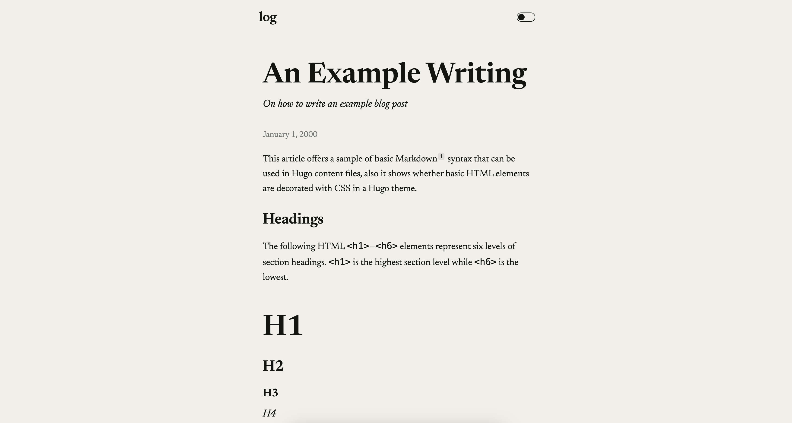

# log

[](https://github.com/GrantBirki/log/actions/workflows/deploy.yml)
[](https://github.com/GrantBirki/log/actions/workflows/unlock-on-merge.yml)
[](https://github.com/GrantBirki/log/actions/workflows/ci.yml)

A personal web log based on my [Dario](https://github.com/GrantBirki/dario) Hugo theme.

View the [live demo](https://log.birki.io) to see what it looks like.



## Development

To run the site locally, simply run:

```bash
hugo server -D
```

Now you can visit [`localhost:1313`](http://localhost:1313/) to see the site.

## Theme Updates

Update Dario to a reviewed commit by passing its full 40-character SHA:

```bash
script/update <40-character-dario-sha>
```

The updater records the resulting immutable pseudo-version in `go.mod`, refreshes the committed `_vendor` snapshot, and verifies that both resolve to the requested commit.

### Open Graph Images

Open Graph images are manually supplied PNG assets committed alongside their posts. Add the image to the post directory, then point the front matter to its public path:

```yaml
ogImage: /posts/example/og.png
```
